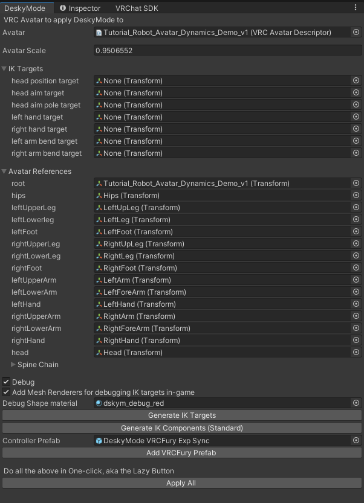

# DeskyMode

VTube in VRChat: 
Unity tool to generate components for head-source, IK-driven avatar motion in desktop VRChat 

https://github.com/user-attachments/assets/9f5cdbd7-b6ab-40de-b037-7ba2bef53d89

Stream Usage Example

 
   

Uses proposed head tracking parameters in VRCFaceTracking [(Head Parameters PR)](https://github.com/benaclejames/VRCFaceTracking/pull/248)

## Setup Instructions

0. Make sure your VRC Avatar Project is up to date 
1. Add [VRCFury](https://vrcfury.com/download) to your project
2. Add [VRLabs' Final-IK-Stub](https://github.com/VRLabs/Final-IK-Stub) to your project
   - Alternatively, you can use the actual [Final IK](https://assetstore.unity.com/packages/tools/animation/final-ik-14290) from RootMotion ($$$). This will require a (simple) modifcation[^1] to a DeskyMode script. **YOU DO NOT NEED FINAL IK TO USE DESKYMODE**. The stub works perfectly fine for VRC. 
3. Add DeskyMode to your project
   - Download the latest `.unitypackage` from the Releases tab and import it into your project
   
[^1]: Open up the `DeskyModeSetup.cs` file and uncomment out the first line (`#define ActualFinalIK`)

## DeskyMode Instructions

DeskyMode can be added to any *humanoid* avatar that has been set up for VRChat. 

0. Make sure your *humanoid* avatar is properly set up for VRChat (with a VRCAvatarDescriptor)
1. Open the DeskyMode tool menu in the top toolbar (Tools -> DeskyMode -> DeskyMode Window)

2. Drag your avatar into the Avatar slot 
   - (Optional) Avatar Scale is set automatically based on your avatar's height. You should only set this manually *if the motion of the targets seem too small/large for your avatar*. Generally, you should **not** need to modify this value!
   - (Optional) Check the "Debug" checkbox to see the transforms DeskyMode uses in generating the FIK components (Avatar References and IK Targets)
   - (Optional) Check the "Add Mesh Renderers" checkbox if you would like debug visualizers mesh primitives
   - The default VRCFury prefab uses the synced parameters asset. Note that it will occupy 53 bits of synced avatar parameters space. You can drop in the other prefab (without the "Sync" suffix) that takes *no* synced parameters, but remote users will only see fixed animations (no DeskyMode movement) if you enter poses via stations or avatar animations. Remote users will see DeskyMode in outside of stations and avatar animations by IK Sync. 

3. Click the "Apply All" button to apply DeskyMode to your avatar

## TODO

 - [ ] Massive code refactor because it's a mess
 - [ ] ~~Workaround the import compilation issue~~ Find another hack for Package distribution
 - [ ] Better window UI 
 - [ ] Add settings for control of certain FIK properties
    - [ ] Spine stiffness
    - [ ] Difference "presets" 
    - [ ] ...
  
## License

**All of the source assets and all generated assets from DeskyMode fall under the [MIT License](https://github.com/kusomaigo/DeskyMode/blob/main/LICENSE)**.

## Credits

- Avatar video credit: [Neri by Graelyth](https://graelyth.gumroad.com/l/rqenf)
- [Titatitanium](https://www.twitch.tv/titatitanium) for streaming with early versions
- Azmidi's [OSCmooth](https://github.com/regzo2/OSCmooth)
- [VRCFT Discord](https://discord.gg/vrcft) for constantly asking for desktop headtracking to be added to VRCFT
